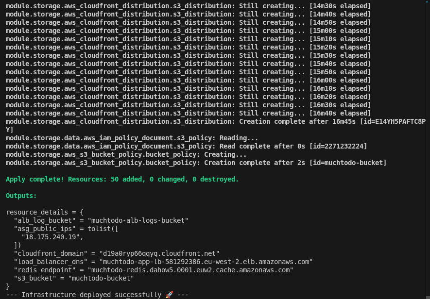
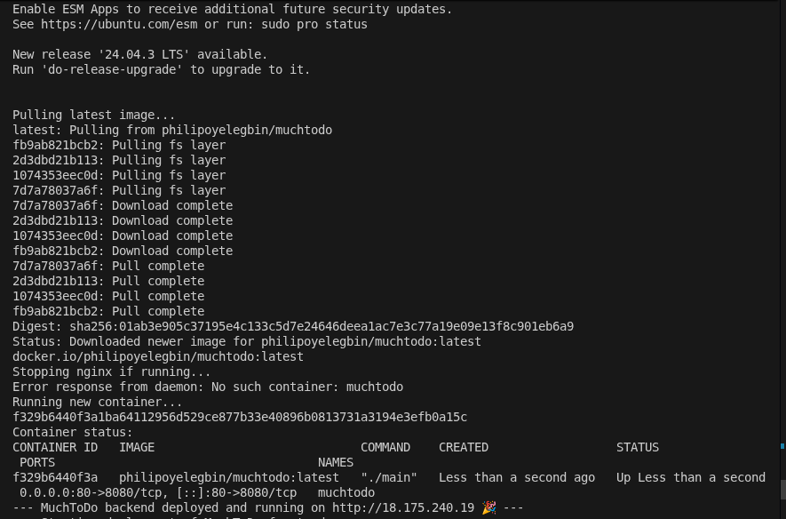
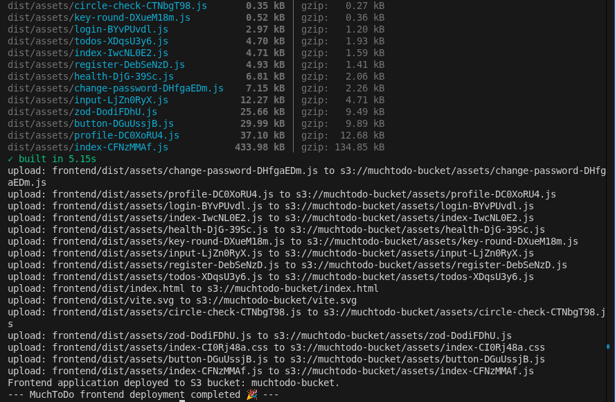
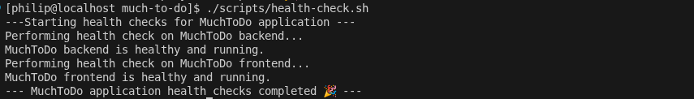
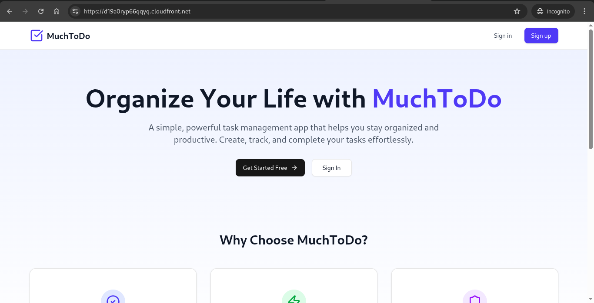
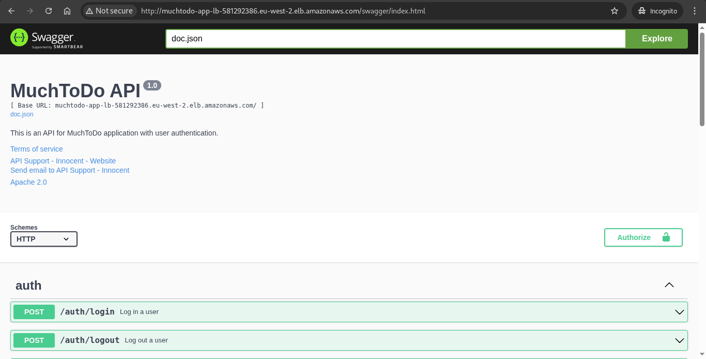
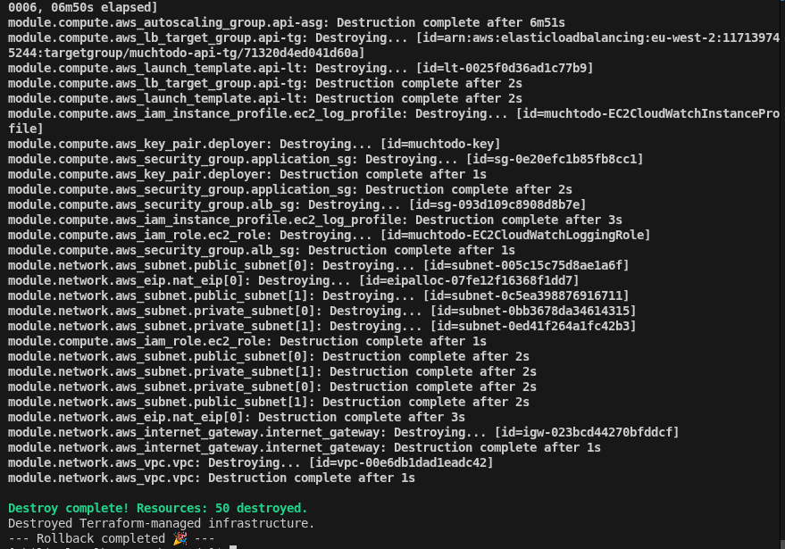

# Month 3 Assessment - Full-Stack CI/CD Pipeline Implementation

Created a comprehensive CI/CD pipeline that automates the entire deployment process from code commit to production, including proper monitoring and security practices.

---

## 📂 Project Structure

```
starttech/
├── .github/
│   └── workflows/
│       └── infrastructure-deploy.yml
│       ├── frontend-ci-cd.yml
│       ├── backend-ci-cd.yml
├── frontend/
├── backend/
├── terraform/
│   ├── main.tf
│   ├── variables.tf
│   ├── outputs.tf
│   ├── modules/
│   │   ├── networking/
│   │   ├── compute/
│   │   ├── storage/
│   │   └── monitoring/
│   └── terraform.tfvars.example
├── scripts/
│   ├── deploy-infrastructure.sh
│   ├── deploy-frontend.sh
│   ├── deploy-backend.sh
│   ├── health-check.sh
│   └── rollback.sh
├── monitoring/
│   ├── cloudwatch-dashboard.json
│   ├── alarm-definitions.json
│   └── log-insights-queries.txt
└── README.md
```

---

## 🛠️ Prerequisites

Before starting, ensure you have the following installed:

- Terraform
- Docker Engine
- NodeJs
- Go 1.21+

---

## 👨🏽‍💻 Setup Instructions

1. Clone the repo and change directory using the command below

   ```bash
   git clone https://github.com/PhilipOyelegbin/month-three-assessment.git

   cd month-three-assessment
   ```

2. Setup the remote state bucket for the infrastructure

   ```bash
   cd terraform/backend

   terraform init
   terraform plan

   terraform apply
   ```

3. Update the file permission of the files in **scripts** folder and create keygen for the infrastucture

   ```bash
   cd ../../

   chmod 740 scripts/*

   ssh-keygen -t ed25519 -f ./terraform/id_rsa -N ""
   ```

4. Run the infrastructure deployment script

   ```bash
   ./scripts/deploy-infrastructure.sh
   ```

   

5. Update the environmental variables appropriately
   - frontend/.env
   - backend/MuchToDo/.env

6. Update the script file below with appropriate variable details from the infrastructure output
   - scripts/deploy-backend.sh
   - scripts/deploy-frontend.sh
   - scripts/health-check.sh
   - scripts/rollback.sh

7. Run the deploy script to deploy the application

   ```bash
   ./scripts/deploy-backend.sh
   ./scripts/deploy-frontend.sh
   ```

   
   

8. Run the health check script to confirm the services are healthy

   ```bash
   ./scripts/health-check.sh
   ```

   

9. The application should be accessible via the CloudFront DNS URL and the load balancer URL.

   
   

10. Destroy the infrastructure by running the rollback script

    ```bash
    ./scripts/rollback.sh
    ```

    

---

## ♻️ CI/CD Implementation

The CI-CD pipeline runs based on the updated folder. If the **terraform** folder is updated, the `infrastructure-deploy.yml` pipeline is triggered. When the **backend** folder is updated, the `backend-ci-cd.yml` pipeline is triggered, and the `frontend-ci-cd.yml` pipeline is triggered on **frontend** folder update and pushed to GitHub.

**Infrastructure Pipeline**

- Plan: This phase is triggered when an update is made to the **terraform** folder and pushed to the **staging** branch
- Apply: This phase is triggered when a PR is merged to the **main** branch from the **staging** branch.
- Cleanup: This phase is triggered when a PR is merged to the **clean** branch.

**Backend Pipeline**

- Build: This phase is triggered when an update is made to the **backend** folder and pushed to the **staging** branch
- Deploy: This phase is triggered when a PR is merged to the **main** branch from the **staging** branch.
- Cleanup: This phase is triggered when a PR is merged to the **clean** branch.

**Frontend Pipeline**

- Build: This phase is triggered when an update is made to the **frontend** folder and pushed to the **staging** branch
- Deploy: This phase is triggered when a PR is merged to the **main** branch from the **staging** branch.

**Demo video**

https://github.com/user-attachments/assets/7cdcbec8-0185-41f2-9c79-1b72aaff9876

---

## 🎯 Task Completed

- [x] Created Auto Scaling Group for backend EC2 instances
- [x] Created Application Load Balancer with target group
- [x] Created S3 bucket for frontend hosting with static website configuration
- [x] Created CloudFront distribution for global content delivery
- [x] Created ElastiCache Redis cluster for caching
- [x] Created CloudWatch Log Groups for application logging
- [x] Created IAM roles and policies for EC2 instances to access CloudWatch
- [x] Created Security Groups for all components
- [x] Scripts created and functional
- [x] Pipeline created and functional

---
